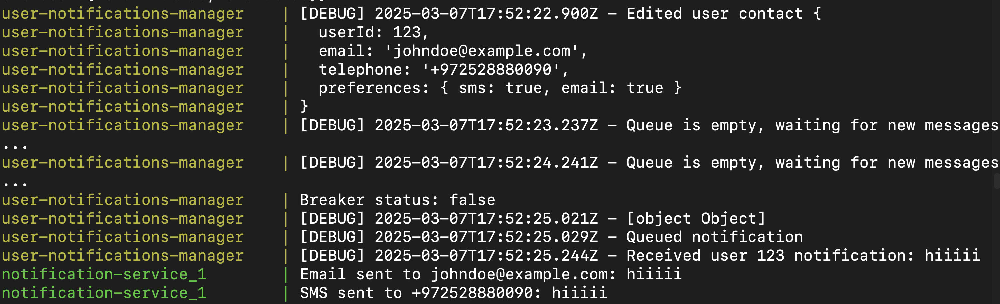

## User Notifications Manager Service 🍻 




### **Axios + Opossum**
  The circuit breaker library together with axios is responsive to the notification-service rate-limit depending on the load on this 3rd party service.

  ## **Endpoints**

  - POST /notifications
    - Create a new user contact.
    - Example CURL command:
      ```
      curl -X POST -H "Content-Type: application/json" -d '{"userID": 123, "email": "johndoe@example.com"}' http://localhost:8080/notifications
      ```

  - PUT /notifications/:userId
    - Edit the contact preference for notifications.
    - Example CURL command:
      ```
      curl -X PUT -H "Content-Type: application/json" -d '{"telephone": "+972528880090", "preferences": {"email": true, "sms": true}}' http://localhost:8080/notifications/123
      ```

  - GET /notifications/:userId
    - Get the user contact information.
    - Example CURL command:
      ```
      curl http://localhost:8080/notifications/123
      ```

  - POST /notifications/send
    - Send a notification.
    - Example CURL command:
      ```
      curl -X POST -H "Content-Type: application/json" -d '{"userId": "123", "message": "Hello, world!"}' http://localhost:8080/notifications/send
      ```
  